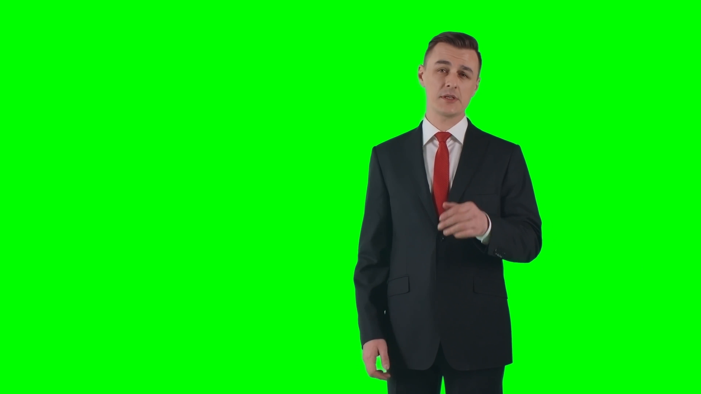
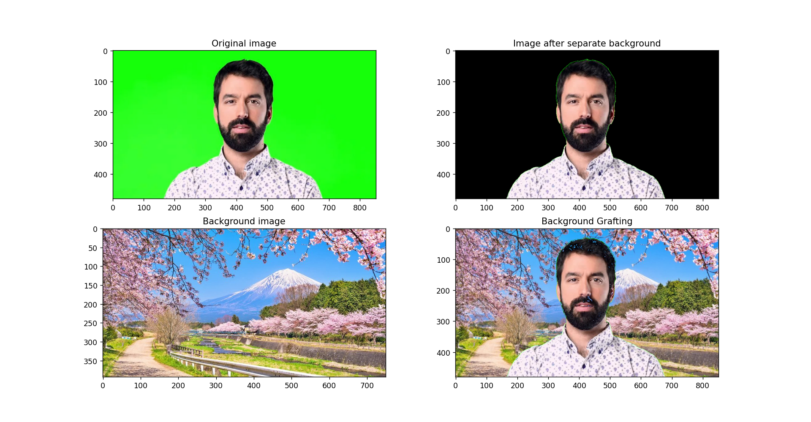

# Color Segmentation with Gaussian Distribution


## Introduction

Chroma key compositing is a post-production technique for compositing two images or video streams together based on color hues, allowing to remove a background from the subject of a photo or video.

Such processes is made possible by making transparent a foreground of an image, where its foreground is composed of green and blue backgrounds that facilitates the process of isolate the interesting parts of an image from their irrelevant background, preserving only the pixels of interests.

# Overview

In this work, we will mainl rely on skimage python toolkit to perform imaging operations in order to:

- Remove a green background from an image while isolating an object.
- Blend multiple images in a single image permiting basic rotation, translation, scale operations.
- Apply basic filters on images.
- Save image on disk

# Chroma-key with Green foreground

## Remove green background

In mathematics, a **ratio** is a relationship between two numbers indicating how many times the first number contains the second. 

Following this notion of ration, the chroma-key strategy implemented in this document is based on the **ratio of the green, red, and blue channels compared to the max-brightness level found on the pixel**.

Therefore, if the **green-ratio** is found systematically higher than the **red-ratio** and the **blue-ratio** it arguably implies the prevalence a green-ish color in the pixel. Based on such nuance of green-ish pixel a threshold constraint is imposed in order to determine whether or not to preserve the pixel by setting a close to zero alpha value, which eventually will lead to completelly ignore such pixel.

```python
def getThreshold(rois):
        
    k = 2
    obj = [[] for i in range(4)]
    
    for roi in rois:
        obj[0] += roi[:, :, 0].flatten().tolist()
        obj[1] += roi[:, :, 1].flatten().tolist()
        obj[2] += roi[:, :, 2].flatten().tolist()
    
    mean_rois = np.array([
        np.mean(np.array(obj[0])), 
        np.mean(np.array(obj[1])), 
        np.mean(np.array(obj[2]))
    ])
    
    var_rois = np.array([
        np.var(np.array(obj[0])), 
        np.var(np.array(obj[1])), 
        np.var(np.array(obj[2]))
    ])
    
    sigma = np.sqrt(var_rois)
    
    obj[3].append(mean_rois - k * sigma) # lower threshold
    obj[3].append(mean_rois + k * sigma) # upper threshold
    
    return obj[3]

# Starting with segmetation on original image
def imageSegmentation(image, lst_rois):
    img = image.copy()
    thresh = getThreshold(getRois(lst_rois))
    img[cv2.inRange(img, thresh[0], thresh[1]) != 0] = np.array([0, 0, 0])
    return img.copy()
```


## Background grafting

In this document, the coordinate axes of an image start at the top-left corner of an image.

In this document, during the blending process it would be permited to rotate, scale, and position the image to be blended on top of the background image.


```python
def backgroundGrafting(oriImg, background):
    background = cv2.resize(background, (oriImg.shape[1], oriImg.shape[0]))
    for i in range(oriImg.shape[0]):
        for j in range(oriImg.shape[1]):
            if oriImg[i,j].all() == 0:
                oriImg[i,j] = background[i,j]
    return oriImg
```
### Save result

```python
def visualizing2Image(originalImg, segmentationImg, backgroundImg, backgroundGrafting):
    f = plt.figure()
    originalImg = cv2.cvtColor(originalImg, cv2.COLOR_BGR2RGB)
    segmentationImg = cv2.cvtColor(segmentationImg, cv2.COLOR_BGR2RGB)
    backgroundImg = cv2.cvtColor(backgroundImg, cv2.COLOR_BGR2RGB)
    backgroundGrafting = cv2.cvtColor(backgroundGrafting, cv2.COLOR_BGR2RGB)
    for i in range(4):
        f.add_subplot(2, 2, i + 1)
        if i == 0: 
            plt.title("Original image")
            plt.imshow(originalImg)
        elif i == 1: 
            plt.title("Image after separate background")
            plt.imshow(segmentationImg)
        elif i == 2:
            plt.title("Background image")
            plt.imshow(backgroundImg)
        else:
            plt.title("Background Grafting")
            plt.imshow(backgroundGrafting)
    plt.show(block=True)
    cv2.waitKey(0)
```

